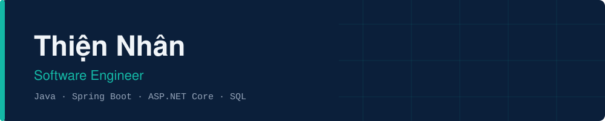

Software Engineer focused on Java backend and web applications.
Based in Vietnam. Looking for a junior or internship position.

---

## Skills

| Area | Stack |
|---|---|
| **Languages** | Java, C#, JavaScript, SQL |
| **Backend** | Spring Boot, ASP.NET Core, REST API |
| **Database** | MySQL, SQL Server |
| **Frontend** | HTML, CSS, JavaScript |
| **Tools** | Git, GitHub |

Currently learning: Spring Security (JWT), Docker, React.

---

## Projects

### CNH Education System
Education management web application: attendance, grading, exams and events.

- Backend: ASP.NET Core, SQL Server ([CNH-Backend](https://github.com/nhanty00234-crypto/CNH-Backend))
- Frontend: HTML, CSS, JavaScript ([CNH-Frontend](https://github.com/nhanty00234-crypto/CNH-Frontend))
- Role-based authentication, exam builder, grade management, face recognition attendance

### V-SPORT
Sports management platform.

- Java, MySQL ([V-SPORT](https://github.com/nhanty00234-crypto/V-SPORT))

### NhietDoiXanh
Landing page for a tea business, with an admin dashboard for revenue reporting.

- Java ([NhietDoiXanh_E-commerce-](https://github.com/nhanty00234-crypto/NhietDoiXanh_E-commerce-))

---

## Contact

- Email: [nhanty00234@gmail.com](mailto:nhanty00234@gmail.com)
- GitHub: [nhanty00234-crypto](https://github.com/nhanty00234-crypto)
